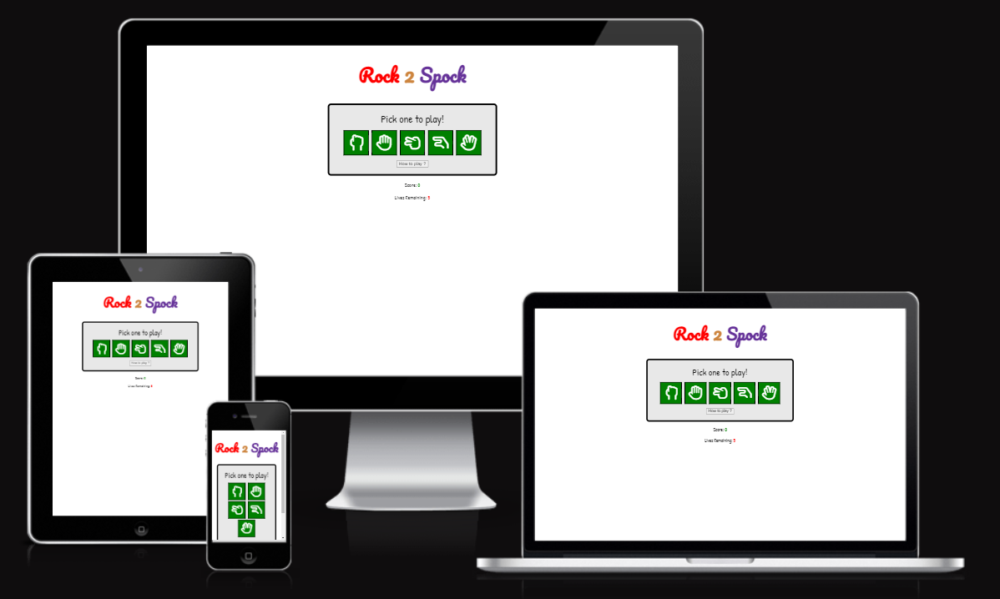
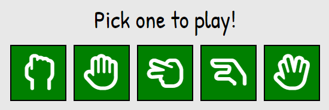
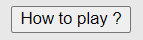
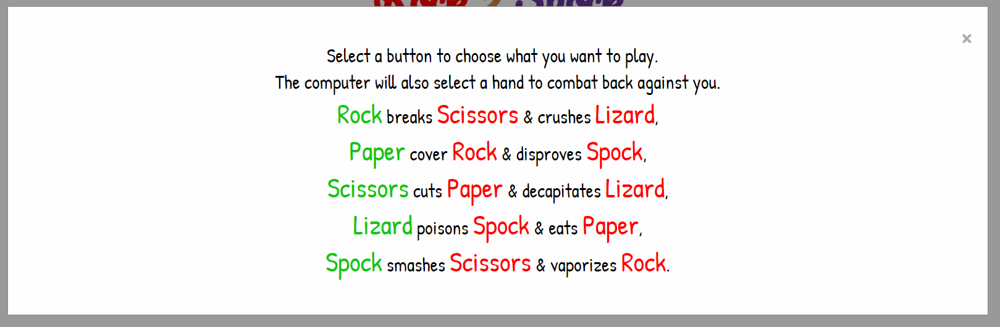
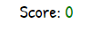
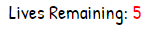

# Rock 2 Spock

Rock 2 Spock is an online browser based "Rock, Paper, Scissors, Lizard, Spock" game based off of the hit show "The Big Bang Theory". This is designed to be a fun and simple game that anybody can play. With a total of five lives you play against the computer and see how high of a score you can garner before running out of lives. Once you run out of lives you will be alerted, informed of the high score you achieved and encouraged to try to beat your score.
This site is targeted towards both people who are simply fans of the show from which the game is based and also those who are looking for a simple fun to play browser game to pass the time. For those that don't know the rules of the game and only know the basic "Rock, Paper, Scissors" game there is a button that will provide the user with the instructions of how to win.

## Features

Rock 2 Spock has a number of different features available to the user to make it a fun an interactive game.
- Heading: 

  - The heading of the website was designed to be prominant on the page and although simple remain memorable and recognisable to the user. The heading and name of the website was designed to be catchy but also match the order in which the buttons for the game are displayed (Going from Rock to Spock).

- Buttons: 

  - The buttons on the website were designed to be interactive and provide feedback to the user, so that the user feels they are pressing a button of importance and not simply clicking on the screen.

- How To Play Button: 

  - When deciding I wanted to create a website to host this game. I first needed to learn the rules of this game myself! I knew then that when creating this website I would like to have somewhere that clearly and concisly explained the rules of the game to the user. This will serve both users who are completely unfamiliar with the game and also those that maybe just need a refresher. I decided against having an entire second page for these rules as the amount of information within the rules did not warrent a full page to itself. However, I also felt that the rules would be too large to place simply on the page itself or in the footer. I then began to think of different way I could have these rules appear on the screen when the user needed them, but also dissapear when not necessary.

- Score counter:

  - I wanted to have a clear and visible score counter so that the user can keep track of how many times they've won before running out of lives. This is coded so that whenever a draw or loss occurs it stays static and upon a win will increment by one. Once the user runs out of lives they are also alerted to what score they got to before it is reset back to zero for a new game to begin.

- Lives counter:

  - Theres no point in having a score counter if theres no limit on how long you can keep playing for. This is why I implements a total amount of lives the user has to play with. This is set at five and will decrement everytime the user loses against the computer. Once this reaches zero the user is alerted they have ran out of lives, notified of their score that they achieved and enouraged to try again. A new game is then created resetting both the users score back to zero and their lives back to five.

## Testing

When writting my JavaScript file I created a large number of functions that I believed I would need to implement to bring to life everything that I wanted to within my website. Through writing and rewriting my code I was able to narrow and erase of lot of these that were deemed excess and unneccessary to what was needed for the website to run smoothly.
After setting up my initial game I was not getting the returns or alerts I expected. Through troubleshooting I discovered this was due to how I had previously set up for the computer generated answer to be dictated. I had used a Math.random() function to pull a random number between 0.0 and 1.0. I think used an if statement to split this into five different increments of 0.2 which were assigned to Rock, Paper, Scissors etc.. Due to this when I placed the variable 'compPick' that I had created into my switch case it was just pulling the Math.random() it was just pulling the number and not the value I had attached to it through the if statement. When brainstorming different ways I could write my vode so that it would pull this correct value, I realised I could make my switch statement not only pull the correct value. But also make my code a lot more concise and overall better by simply pulling the data from my already created array named options that held these values. I then attached the Math.trunc() function to my Math.random() to remove any decimals and multiplied this by 5 so that it would match an acompanying value of the array.

During this time I also decided to change how I had written my object in which it was displaying the different synonyms of how the user could win from 'crushes, cuts, vaporizes etc.. to simply win, lose or draw. The reason for this was to allow for the switch statement to also me a lot more concise instead of having up to 10 different cases. This allowed me to have a case for win, case for lose and a default show a draw be pulled. 

Once I had implemented this new code and tested it, I believed my code was working exactly as I wanted to. I ran a test that returned a computer choice of "Rock" verses my own choice as user of "Rock" as well. This ran the default of the switch statement and returned a tie. When running a second test I realised something wasn't quite right as my alert returned "user picked lizard, computer picked scissors so it was a tie". As this was clearly incorrect I knew my code was as well. I ran the code a number of times more and no matter the user input or computer choice generated the result was also a tie. I knew that this meant my switch statement was not working correctly and it was not checking the parameters for my win or loss case and simply returning the default of the statement. I used dev tools to help troubleshoot this and I was shown an error on a certain line of my code that related to where I had compared answers. To try and troubleshoot this further I ran a simply console log of this statement which returned undefined. This helped me to realise one of both of the values was not being pulled correctly. I removed the user choice from this and ran it again and it was showing the correct result. This helped me to realise the issue was where I was pulling the userpick in my check. When console logging that directly it was not returning the array values and only returning undefined. It took me some time going through my code line by line to see where the problem was, but when I did spot it, it was glaringly obvious why my code would not run. as userPick was the name of the function I had created and not the values themselves. I simply changed this to the input defined in the function itself and re-ran my code to see it was now returning the correct result and using the switch statement as correctly intended.

When rereading my code a number of times it didn't look as legible as I would like it to be should I be reading somebody elses code so I knew I had to tidy some things up. The first thing I did was remove certain functions and variables that had become redundant due to troubleshooting I had done. I then moved variables I had created that were being called after functions in which they were being used above said functions. This simply makes it easier to read and locate everything. I then noticed some lines of code that I was repeating a number of times and remeber being told that if you find yourself rewriting the same code over again there's usually an easier way to do it. The code in question was where the user score and lives remaining were being set. This was being wrote out a number of times and then again when the lives had ran out. I was able to make this even more concise and neater by removing it and placing it into a singular function that could be called whenever needed instead of the two lines of code being rewrote every time.

### Validator Testing

- HTML
  - No errors or warnings were returned when passing through the [W3C Validator](https://validator.w3.org/nu/?doc=https%3A%2F%2Fcmurphy94.github.io%2FRock2Spock%2F)
- CSS
  - No errors or warnings were returned when passing through the [(Jigsaw) Validator](https://jigsaw.w3.org/css-validator/validator?uri=https%3A%2F%2Fcmurphy94.github.io%2FRock2Spock%2F&profile=css3svg&usermedium=all&warning=1&vextwarning=&lang=en)
- JavaScript
  - No errors were returned when passing through the [JShint Validator](https://jshint.com/)
    - The following metrics were returned:
    - There are 6 functions in the file.
    - Function with the largest signature takes 2 arguements, while the median is 0.5.
    - The largest function has 8 statements in it, while the median is 2.
    - The most complex function has cyclomatic complexity value of 4 while the median is 1.

## Deployment

This website was deployed directly to GitHub. The steps to do this is as follow:
- In the repository, select settings.
- On the left side nav bar, select pages.
- Under branch, select main and then hit save.
- Allow some time for the website to deploy and the link for the website will appear at the top of pages.

The live link for my website can be found here - https://cmurphy94.github.io/Rock2Spock/

## Credits

When designing how I wanted my webpage to look I garnered inspiration on how the user could select what they wanted to play from a similar browser game which was https://rockpaperscissorslizardspock.dev/ 
I really liked how this website provide the different hand signs for the game which the user could click on to select what they wanted to play and knew I wanted to implement something similar.
I was able to get these hand signs directly from Font Awesome and added titles to these buttons for visually impaired users.

When wanting to implement a pop up window to display the instructions on how to play the game I wasn't exactly sure how I needed to code this and used W3Schools to learn how to do this which I was able to get implementable code from https://www.w3schools.com/howto/tryit.asp?filename=tryhow_css_modal

When adjusting my CSS for smaller screen sizes I did not want my heading to fall under itself. I was able to stop this from occuring by using white-space: no wrap and I was able to learn how this works and the code for it from StackOverflow directly from https://stackoverflow.com/questions/5232310/how-can-i-force-div-contents-to-stay-in-one-line-with-html-and-css

To make the user feel like it was important as to what button they selected when playing their hand I wanted something more to happen to the button than it simply just changing colors. I was able to find a very small and simple animation that I could add onto these selection buttons that feels great for the user to select. I obtained this code from https://www.florin-pop.com/blog/2019/03/css-pulse-effect/